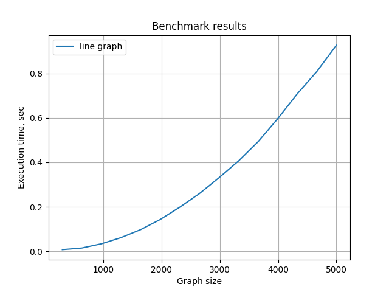
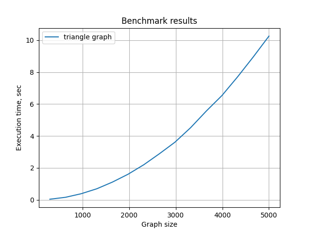
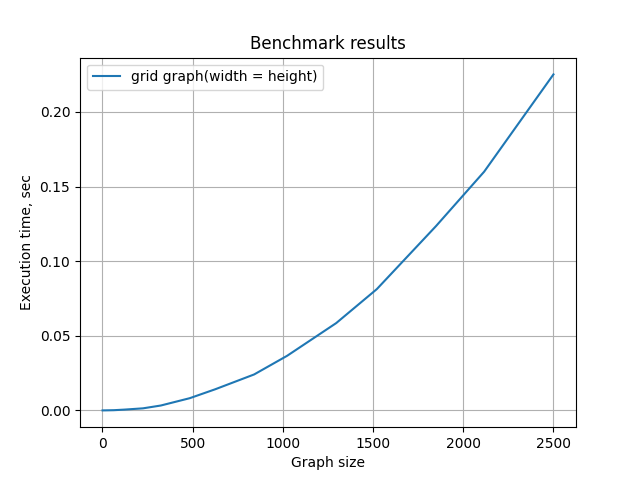
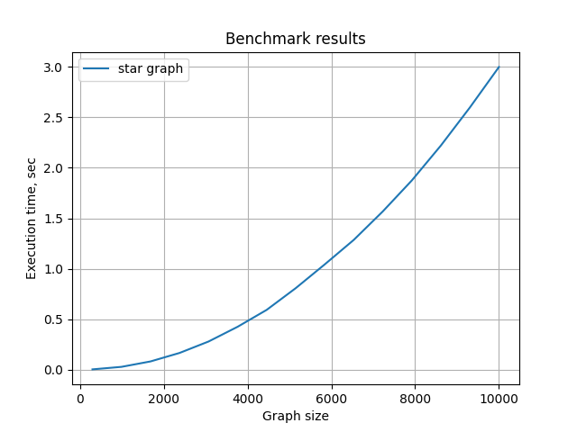
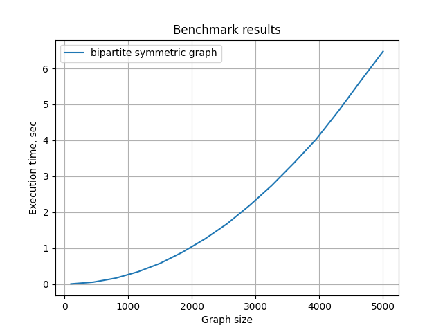
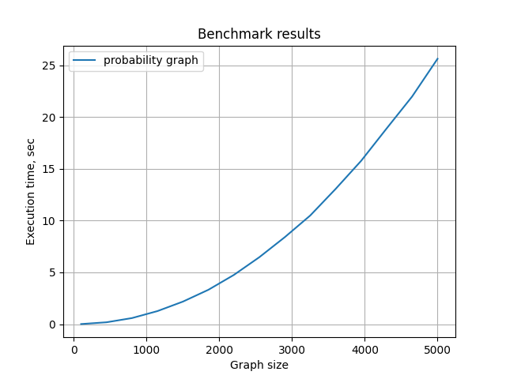

# 84. Раскраска 3-раскрашиваемого графа
_Известно, что граф можно раскрасить в 3 цвета. Имплементируйте полиноми- альный алгоритм, красящий граф в $\mathcal{O}(\sqrt n)$ цветов. (Известно много алгоритмов разной степени сложности, в том числе с гораздо лучшими оценками. Чем более простой алгоритм вы используете, тем больше нужно рассказать о том, как вы ищете и анализируете тестовые примеры)_

## Формальная постановка задачи:
$G = \left (V, E \right)$, $|V| = n$, $\chi(G) \leq 3$. Раскрасить граф в $\mathcal{O}(\sqrt n)$ цветов за полиномильное время

## Алгоритм:
Пусть $\Delta(G)$ -- максимальная степень вершины графа. Тогда на каждом шаге: 
* Если $\Delta(G) \leq \sqrt n$, то раскрасим граф в $\Delta(G) + 1$ цвет простым алгоритмом: берем новую непокрашенную вершину и красим любым подходящим цветом. Такой цвет всегда найдется, так как соседей не больше $\Delta(G)$, а цветов $\Delta(G) + 1$
* Иначе, найдем вершину $v$ максимальной степени. Ее степень $k$ хотя бы $\sqrt n + 1$. Все соседи $u_i$ этой вершины могут быть раскрашены в 2 цвета, так как изначально граф можно было раскрасить в 3-цвета. Удалим вершину $v$ и всех ее соседей $u_1, ..., u_k$ и переходим к решению задачи для меньшего графа $G(V \setminus \{v, u_1, ..., u_k\}, \{e = (x, y) | e \in E, x, y \notin \{v, u_1, ..., u_k\}\})$. Подобных удалений будет не более $\sqrt n$, причем на каждое удаление используется 3 уникальных цвета. Если $\Delta(G) \leq \sqrt n$ то мы используем не более $\sqrt n$ цветов. Всего получается $\leq 4 \sqrt n$ цветов, то есть $\mathcal{O}(\sqrt n)$ цветов.

## Тесты:
Тесты делятся на несколько категорий:
* Тесты интерфейса графа `test_basic`
* Тесты на крайние случаи `test_extreme`
* Базовые тесты на простых графах `test_main`
* Основные тесты на графах большого размера `test_large`
* Нагрузочные тесты, проверяющие работу алгоритма на нескольких сотнях запусков `test_benchmark`. Проверяем на нескольких типах графах: граф-бамбук разной длины, Несколько графов $K_3$, граф-сетка $n \times m$, граф-звезда c переменным количеством вершин, двудольный граф разных размеров, граф из трех долей с вероятностью наличия ребра $p$.


Все тесты запускаются при помощи:
```shell
pytest .  
```
Только нагрузочные тесты запускаются с помощью:
```shell
pytest --benchmark-only .
```

## Анализ нагрузочных тестов:
### Граф-бамбук:
```shell
pytest --benchmark-only tests/test_benchmark.py::test_line_graph
```
Самый быстрый запуск на графе размера 100 - 116 итераций, самый долгий на графе размера 5000 - 379e3 итераций. Степень вершины у таких графов всегда 1 или 2, так что ребра никакие вершины не удаляются, алгоритм начинает сразу красить в 2 цвета. Заметим, что количество операций примерно $\mathcal{O}(n^{2.07})$

График бенчмарка:



### Несколько графов $K_3$:
```shell
pytest --benchmark-only tests/test_benchmark.py::test_3n_graph
```
Наименьшее время занимает граф из 100 треугольников - на него уходит 1e3 итераций, наибольшее - из 5000 треугольников, алгоритм работает за 3.5e6 итераций. В подобных графах каждой вершины 2, поэтому мы сразу начинаем красить в 3 цвета. Время работы $\mathcal{O}(n^{2.09})$

График бенчмарка:




### Граф-сетка $n \times m$:
```shell
pytest --benchmark-only tests/test_benchmark.py::test_3n_graph
```
Самое длительное время обрабатывается граф $50 \times 50$ - 91e6 операций, быстрее всего $1 \times 1$ - 625 операций

Алгоритм работает примерно за $\mathcal{O}(n^{2.1})$ операций

График бенчмарка для квадратной сетки:



### Граф-звезда:
```shell
pytest --benchmark-only tests/test_benchmark.py::test_star_graph
```
Быстрее всего граф из 100 вершин: 229 операций. Дольше всего обрабатывается граф из 10'000 вершин: 3e6 операций. В таких графах сразу удаляется центральная вершина, поэтому на следующем этапе мы начинаем красить все остальные вершины.
Количество операций растет как $\mathcal{O}(n^{2.2})$

График бенчмарка:



### Двудольный граф: 
```shell
pytest --benchmark-only tests/test_benchmark.py::test_bipartite_graph
```
Самый быстрый тест: доли минимального размера(100) 1.79 итераций, самый долгий: максимальные размеры долей(5000) 5.5e3 итераций. Количество операций растет как $\mathcal{O}(n^{1.8})$

График бенчмарка для графа с равными долями:




### Трехдольный граф с вероятностью ребра $p$
```shell
pytest --benchmark-only tests/test_benchmark.py::test_prob_graph
```
Самый быстрый тест $p=0.1$, $n=30$ - 16 интераций, самый долгий $p=0.1, n = 3000$. В среднем, для фиксированного количества вершин быстрее выполняется алгоритм для графа с большим $p$, потому что алгоритм на начальных стадиях выкидывает много вершин и сильно уменьшает граф

График бенчмарка:

